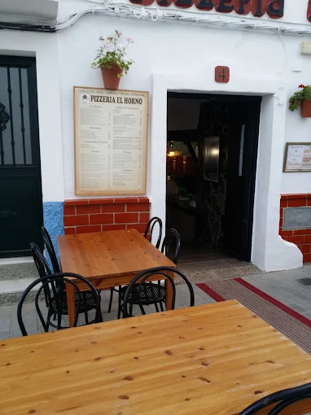

# PROYECTO DIGITALIZACIÓN
## PIZZERIA EL HORNO

**FICHA EMPRESA:** 
2. Selecciona un sector y una empresa: Define una empresa (ficticia o real) de un sector concreto y especifica sus características principales (tamaño, productos, clientes, etc.).
La empresa con la que vamos a trabajar es una pizzería pequeña de Conil de la Frontera, llamada El Horno.

Se ubica exactamente en la calle Sauceda, número 4 (CP 11140) y tiene un horario de viernes a domingo de 19h a 00h.

 Es una empresa dedicada a la restauración, trabajando principalmente con pizzas, aunque en su menú también cuenta con lasañas, pastas, calzones, ensaladas, tostas…

Se trata de una pequeña empresa que cuenta con un único local y con una plantilla reducida de 5 trabajadores en invierno y con 9 empleados en la temporada alta de verano.

El público general en el que se enfoca son en su mayoría jóvenes y familias.En invierno se dirigen más a clientes locales con un horario reducido, pero en verano amplían horario y se centran en turistas, ofreciendo su servicio principalmente a visitantes alemanes, franceses e ingleses que veranean en la ciudad.

